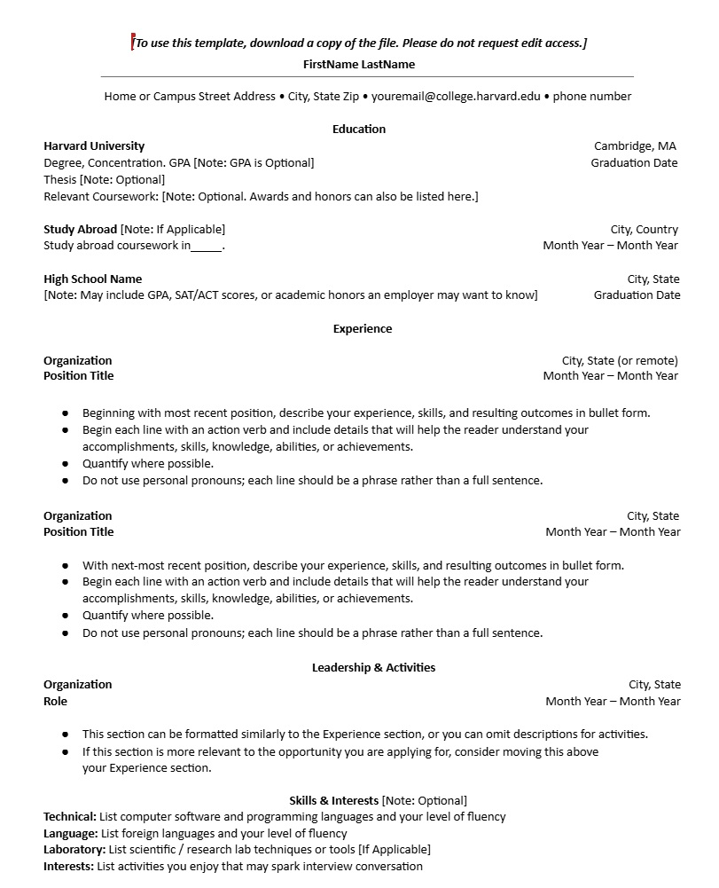

# Frontend Specificaiton

- Create a static website that serves an HTML resume.

## Resume Format Considerations

I live in the United States, where resume standards emphasize clarity, professionalism, and fairness. As a general practice, resumes in Word or PDF format should avoid including personal details that could lead to  bias— such as age, marital status, photos, or unrelated personal information.

In the U.S., resumes typically follow a streamlined structure that highlights skills, measurable achievements, and relevant experience. The focus is on presenting clear evidence of impact rather than providing extensive personal background or narrative.

To ensure a polished and modern presentation, I will be using an augmented version of the [Harvard Resume Template](https://careerservices.fas.harvard.edu/channels/create-a-resume-cv-or-cover-letter/#uc_resource_tiles-4), that reflects a post-graduate with experience, as the foundation for my resume. I’ll adapt and customize it to emphasize my strengths, technical capabilities, and career accomplishments in a clear and effective way.

```
I’m already comfortable with HTML, so I’m letting ChatGPT handle the initial heavy lifting. It can generate the core HTML and possibly the supporting CSS— and from there I’ll manually refactor the code to match my preferred standards.
```

### Image Provided to ChatGPT



### Chat GPT Augmented Harvard Format
This is the augmented HTML rendered by ChatGPT

[Harvard Resume Template](./public/index.html)


